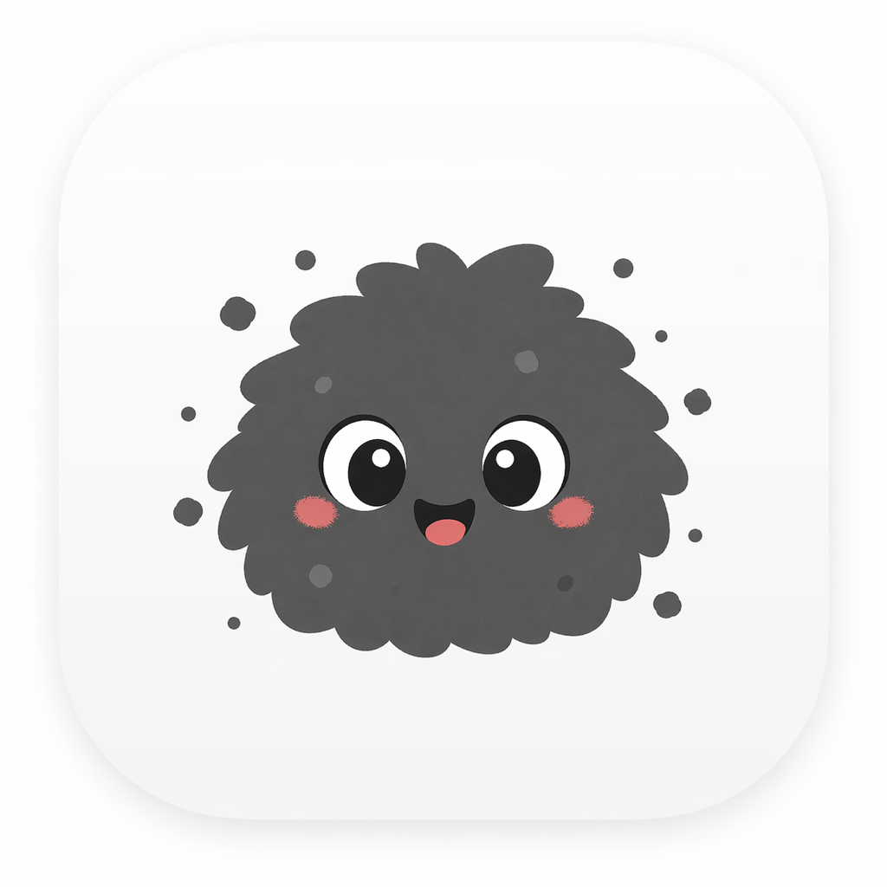

<p align="center">
  
</p>

# Dusto

Dusto is a macOS desktop productivity toolbox built with Electron, React, TypeScript, TailwindCSS, and Zustand.

It brings small practical tools into one calm workspace, with a cute dust character theme that makes the app feel warm, light, and quietly helpful. Dusto is local-first: supported assistant, meeting, storage, and export flows are designed around explicit user action and app-owned desktop capabilities.

## What Dusto Is

Dusto is a personal productivity desktop app for individual macOS users who want a fast, friendly place to capture notes, manage tasks, sketch ideas, draft HTML, export PDFs, and review meeting recordings.

The app is not a cloud collaboration product and not a remote agent platform. It keeps the product surface focused on local desktop utility:

- A conversational home surface for supported in-app actions
- Direct access to focused productivity modules
- Local persistence through the Electron main process
- Clear fallback states when optional local runtimes are unavailable
- A friendly character-driven interface without hiding the underlying tools

## Current Modules

### Home / Assistant

The home screen is the primary conversational entry point. It provides a chat-first surface where the user can ask Dusto to perform supported in-app productivity tasks.

Supported assistant direction includes:

- Checking local runtime availability
- Creating or transforming notes
- Extracting and creating todos
- Helping set up canvas boards
- Drafting HTML content
- Showing action results in context
- Asking for confirmation before destructive or high-impact actions

Assistant behavior is local-first and tool-backed. Dusto does not depend on a Dusto-hosted inference service.

### Todo

The Todo module supports small daily task management:

- Add tasks
- Mark tasks complete
- Delete tasks
- Review the current task list

### Notes

The Notes module is for quick text capture:

- Create notes
- Edit notes
- Delete notes
- Browse saved notes

### Canvas

The Canvas module provides a lightweight visual workspace:

- Create boards
- Open existing boards
- Rename boards
- Delete boards
- Persist board content locally

### HTML Editor & PDF Export

The HTML Editor module supports writing or pasting HTML and previewing it live:

- Raw HTML editing
- Live preview
- PDF export through the Electron preload and main-process boundary
- Native save dialog for PDF output

### Meetings

The Meetings module supports user-initiated microphone recording and local meeting review:

- Microphone permission checks
- Start and stop recording from the app
- Save meeting audio through the main process
- Store meeting metadata locally
- View meeting list and detail screens
- Run local transcription when a supported STT runtime is available
- Generate local summaries when a supported local AI runtime is available
- Review transcript, summary, decisions, action items, risks, and follow-ups

Out of scope for the current Meetings module:

- System audio capture from other apps
- Live subtitles
- Speaker diarization
- Cloud transcription
- Team sharing or sync
- Automatic background recording

## Tech Stack

- Electron for the macOS desktop shell and native integrations
- React for the renderer UI
- TypeScript for strict application code
- TailwindCSS for styling
- Zustand for renderer state management
- Electron preload IPC for safe renderer-to-main communication
- Local app storage handled through the main process

## Project Structure

```text
src/
  main/         Electron main process, native APIs, persistence, local runtime adapters
  preload/      Typed and constrained bridge between main and renderer
  renderer/     React application
    app/        App shell, module registration, and top-level pages
    components/ Shared UI components
    modules/    Feature modules
    stores/     Shared renderer stores
    styles/     Tailwind entry and global styles
    types/      Renderer-only type declarations

assets/         Character and visual assets
build/          App icon assets used for packaging
docs/           Product, architecture, rules, and task documents
agents/         Optional role guides for structured collaboration
```

## Main Development Rules

Dusto follows the rules in `docs/RULES.md`, `docs/ARCHITECTURE.md`, and `docs/PRD.md`.

Important constraints:

- Keep renderer code away from direct Node access
- Route system work through preload IPC and main-process handlers
- Keep preload APIs minimal, explicit, and typed
- Use Zustand for state
- Use TailwindCSS for styling
- Keep user-facing features inside the current product scope unless explicitly re-scoped
- Preserve the local-first assistant and meetings model
- Avoid hidden background actions or remote orchestration

## Getting Started

Install dependencies:

```bash
npm install
```

Run the app in development:

```bash
npm run dev
```

Run TypeScript validation:

```bash
npm run typecheck
```

Build the Electron app output:

```bash
npm run build
```

Create a packaged macOS distribution:

```bash
npm run dist
```

## Available Scripts

| Script | Purpose |
| --- | --- |
| `npm run dev` | Start the Electron Vite development app |
| `npm run build` | Build the Electron Vite output |
| `npm run dist` | Package the app with Electron Builder |
| `npm run preview` | Preview the built Electron Vite output |
| `npm run typecheck` | Run TypeScript without emitting files |

## Local Runtime Notes

Dusto is designed to work with local runtimes for assistant, transcription, and summarization features when those runtimes are available on the user's machine. These runtimes are optional for basic app use, but they are required for the local AI and meeting intelligence features.

The app should always present clear fallback states if local AI, STT, or required helper binaries are missing. Core non-AI modules such as Todo, Notes, Canvas, and HTML editing should remain understandable and directly accessible.

### Assistant And Meeting Summaries With Ollama

Dusto uses Ollama as the current local AI runtime. The Electron main process checks Ollama at `http://127.0.0.1:11434` and looks for an installed local model.

Recommended setup:

1. Install Ollama for macOS from the [official Ollama macOS guide](https://docs.ollama.com/macos).
2. Make sure the `ollama` CLI is available at one of the expected macOS paths, such as `/opt/homebrew/bin/ollama` or `/usr/local/bin/ollama`.
3. Start Ollama.
4. Pull the default Dusto model:

```bash
ollama pull qwen3:4b
```

5. Open Dusto and choose the installed model from the assistant runtime status card if needed.

Useful checks:

```bash
ollama list
ollama serve
```

`qwen3:4b` is the current default target because it keeps local chat and tool routing fast on typical Apple Silicon Macs. Users with stronger hardware can install and select a larger local instruct model, but Dusto should not require a large model to be useful.

### Meeting Transcription With whisper.cpp

Meeting transcription is handled locally with `whisper.cpp`. Dusto checks for three things:

- A whisper runtime binary
- A GGML whisper model file
- `ffmpeg` for converting recorded audio before transcription

Expected whisper binary paths include:

- `/opt/homebrew/bin/whisper-cli`
- `/usr/local/bin/whisper-cli`
- `/opt/homebrew/bin/whisper-cpp`
- `/usr/local/bin/whisper-cpp`

Expected `ffmpeg` paths include:

- `/opt/homebrew/bin/ffmpeg`
- `/usr/local/bin/ffmpeg`
- `/usr/bin/ffmpeg`

Example Homebrew setup:

```bash
brew install whisper-cpp ffmpeg
```

Dusto also needs a whisper GGML model file. The [Homebrew `whisper-cpp` formula](https://formulae.brew.sh/formula/whisper-cpp) notes that `whisper-cpp` requires GGML model files, and the upstream [`whisper.cpp` project](https://github.com/ggml-org/whisper.cpp) publishes compatible model downloads.

The app checks common locations, including:

- `~/.local/share/whisper.cpp/models/ggml-base.bin`
- `~/.local/share/whisper.cpp/models/ggml-base.en.bin`
- `~/models/whisper.cpp/ggml-base.bin`
- `~/models/whisper.cpp/ggml-base.en.bin`
- `/opt/homebrew/share/whisper-cpp/models/ggml-base.bin`
- `/opt/homebrew/share/whisper-cpp/models/ggml-base.en.bin`

Example model setup:

```bash
mkdir -p ~/.local/share/whisper.cpp/models
curl -L \
  https://huggingface.co/ggerganov/whisper.cpp/resolve/main/ggml-base.en.bin \
  -o ~/.local/share/whisper.cpp/models/ggml-base.en.bin
```

For Korean or multilingual meetings, use `ggml-base.bin` or another multilingual whisper model instead of the English-only `ggml-base.en.bin`.

Advanced users can override auto-detection with environment variables before launching Dusto:

```bash
export DUSTO_WHISPER_BINARY=/path/to/whisper-cli
export DUSTO_WHISPER_MODEL=/path/to/ggml-base.bin
export DUSTO_FFMPEG_BINARY=/path/to/ffmpeg
```

### Feature Availability Summary

| Feature | Runtime Needed |
| --- | --- |
| Todo, Notes, Canvas, HTML editor | No external runtime |
| Assistant chat and tool routing | Ollama running with a selected local model |
| Meeting summaries | Ollama running with a selected local model and an existing transcript |
| Meeting transcription | whisper.cpp binary, GGML whisper model, and `ffmpeg` |

## Packaging Notes

The app is configured with Electron Builder:

- App ID: `com.dusto.app`
- Product name: `Dusto`
- Output directory: `release`
- macOS target: `dmg`
- Icon: `build/icon.icns`

Generated output folders such as `out/` and `release/` are ignored by Git.

## Repository Hygiene

The repository intentionally tracks source files, documents, package metadata, and owned visual assets. Local-only and generated files are ignored, including:

- `node_modules/`
- `out/`
- `release/`
- `.env` files
- local Claude settings
- macOS `.DS_Store` files

## Product Philosophy

Dusto should feel simple, useful, and friendly. The dust character gives the app personality, but the product goal is practical: help the user get small desktop productivity tasks done quickly without juggling too many separate apps.

The guiding principles are:

- Utility first
- Local-first behavior
- Explicit user action
- Lightweight interactions
- Calm visual design
- Clear module boundaries
- Friendly character presence
